<div align="center">
    <h1>React Native UI Blueprint</h1>
    
    <p align="center">
        To develop pixel perfect apps
    </p>    
    <p>
        <a href="https://badge.fury.io/js/react-native-ui-blueprint">
            
        </a>
    </p>
</div>

<br>

No more wrong margins, text sizes and many other silly visual mistakes. **React Native UI Blueprint** allow to you implements a pixel-perfect design.
 
<div align="center">
    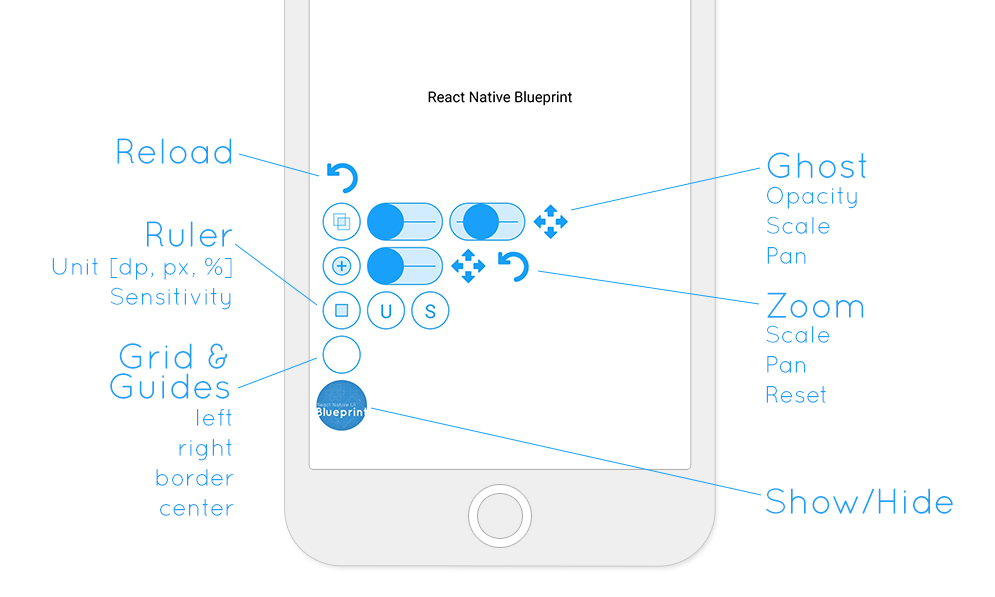
</div>


## Installation

You can install React Native UI Blueprint via Yarn or NPM.

```bash
# Yarn
yarn add react-native-ui-blueprint

# NPM
npm i react-native-ui-blueprint --save
```

After that, simply encapsulate your application with Blueprint and finally tap the bottom left of the device to show Blueprint.

```jsx
import Blueprint from 'react-native-ui-blueprint';


export default class App extends React.PureComponent {
    render() {
        return (
            <Blueprint>
                <StatusBar backgroundColor={'transparent'} translucent={true} barStyle="dark-content"/>
                <View style={[StyleSheet.absoluteFill, {justifyContent: 'center', alignItems: 'center'}]}>
                    <Text>
                        {'My App'}
                    </Text>
                </View>
            </Blueprint>
        );
    }
}
```

## Reload

For those who are too lazy to shake the phone, when running Packager (on port 8081), lets you reload the application.

## Grid

<div align="center">
    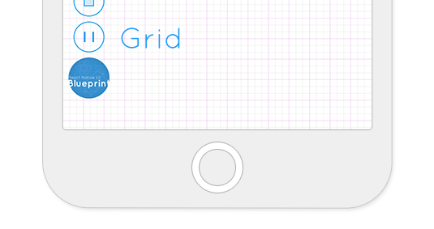
</div>

Displays grids on your application, allowing the development of interfaces with regular and homogeneous spacing.

When working in teams, designers often use grid, use this tool to verify design implementation.

```jsx
<Blueprint            
    grid={[
        {
            spacing: 30
        },
        {
            spacing: 60
        }
    ]}
 >
    ...
</Blueprint>
```

By default, Blueprint already defines two grids with 8 and 24 [dp] spacing.

You can completely remove the grid by passing `false` as parameter.

```jsx
<Blueprint            
    grid={false}
 >
    ...
</Blueprint>
```

### Alignment

There are 4 horizontal alignment options:

#### Side
 
The grid is created from the side, respecting the defined spacing. Useful for validating component spacings and side positions.

#### Center

The grid is created from the center of the screen, respecting the defined spacing. Used to check centralized alignment of components.

#### Left and Right

The grid is created from the defined side.

### Grid Properties

| name | type | default | Description |
|---|---|---|---|
| `spacing` | `number` | -- | The spacing between grid lines. In [dp] |
| `color` | `string` | `GRAY:#828282`, `MAGENTA:#ff4aff` or `BLUE:#18A0FB`| Allows you to set the line color. If not informed, the system will switch between GRAY, BLUE and MAGENTA |
| `opacity` | `number` | `0.2 + $index * 0.1` | Allows you to set opacity. If not entered, the system automatically calculates a value starting with `0.2` and increasing by `0.1` |
| `width` | `number` | `StyleSheet.hairlineWidth` (1 pixel) | Lets you set the line width |

## Guides

<div align="center">
    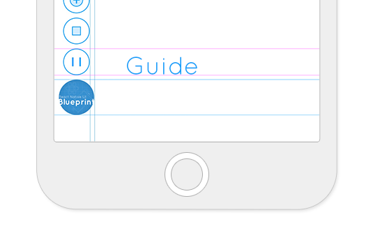
</div>

Displays vertical or horizontal guide lines with specific placement. Unlike the grid, the guides does not repeat and allows you to work with three units of measurement: pixel, [dp] and percent.

```jsx
<Blueprint            
    guides={[
        {
            position: 55,
            orientation: 'vertical',
            unit: 'dp'
        },
        {
            position: 616,
            orientation: 'horizontal',
            unit: 'dp',
            color:'#ff4aff'
        },
        {
            position: 580,
            orientation: 'horizontal',
            unit: 'dp',
            color:'#ff4aff'
        }
    ]}
 >
    ...
</Blueprint>
```

By default Blueprint displays one vertical and one horizontal line, both on 50% of the screen.

You can completely remove the guides by passing false as parameter.

```jsx
<Blueprint            
    guides={false}
 >
    ...
</Blueprint>
```

### Guides Properties


| name | type | default | Description |
|---|---|---|---|
| `position` | `number`  | -- | The positioning of the guide. When the unit is pixel, expect an integer. |
| `orientation` | `horizontal` or `vertical` | --| Sets the orientation of the guide |
| `unit` | `%`, `dp` or`px` | `dp` | The unit of measurement used to set the guide position |
| `color` | `string` | `BLUE:#18A0FB`| Allows you to set the line color. |
| `opacity` | `number` | `0.2 + $index * 0.1` | Allows you to set opacity. If not entered, the system automatically calculates a value starting with `0.2` and increasing by `0.1` |
| `width` | `number` | `StyleSheet.hairlineWidth` (1 pixel) | Lets you set the line width |


## Ruler

<div align="center">
    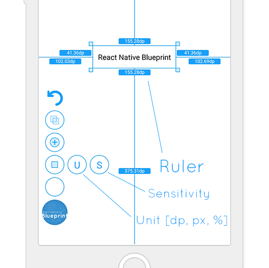
    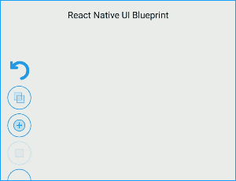
</div>

Adds a scalable ruler to the screen. The ruler is useful for checking component size and distance from the edges of the screen.

Allows you to change the unit of measurement to pixel, [dp], or percent.

The ruler also allows you to change the sensitivity to work more accurately. The values are toggled by `1`, `0.5` and `0.1`.

## Ghost

<div align="center">
    
    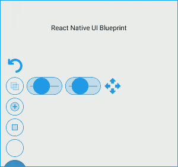
</div>

Allows developers and designers put a semi-transparent image overlay over the top of the developed App and perform pixel perfect comparison between them.


You can add local files or configure remote calls asynchronously. With remote calling, you can implement integrations with any Wireframe system that provides an API.


### Local files

<div align="center">
    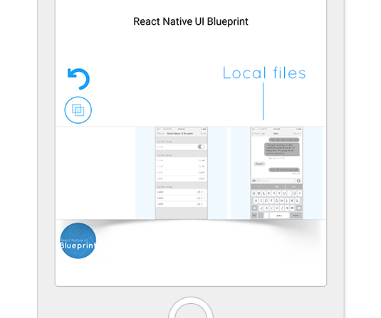
</div>

```jsx
<Blueprint            
    images={[
        require('./assets/wireframe-1.png'),
        require('./assets/wireframe-2.png')
    ]}
 >
    ...
</Blueprint>
```

### Remote files

<div align="center">
    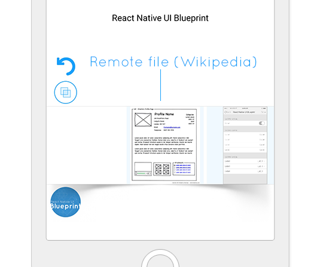
</div>

If you know the full path of the screen images, just tell uri. Blueprint looks for information about the height and width of the images.


```jsx
<Blueprint            
    images={[
       {
           uri: 'https://upload.wikimedia.org/wikipedia/commons/4/47/Profilewireframe.png'
       },
        require('./assets/wireframe-1.png'),
        require('./assets/wireframe-2.png')
    ]}
 >
    ...
</Blueprint>
```

### Custom Server

<div align="center">
    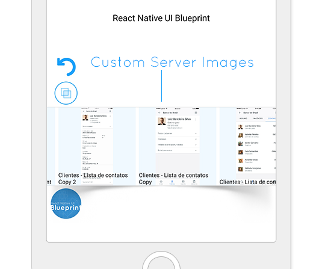
    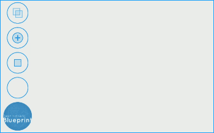
</div>


You can also use some private image server. An example implementation, with node.js, is available in the "server" folder.

External integration allows the use of any image service that provides an API for listing and viewing images.

You can look for documentation from services like [Zeplin](https://zeplin.io/) or [Figma](https://www.figma.com/) to do your integrations.


For integration, simply implement an asynchronous function in the `imagesAsync` property.

**Type**
```jsx        
type ImageInfoAsync = {
    thumb?: {
        uri: string;
        width?: number;
        height?: number;
    };
    uri: string;
    width?: number;
    height?: number;
    title?: string;
};

const imagesAsynck: () => Promise<Array<ImageInfoAsync>>; 
```

**Sample**
```jsx
<Blueprint            
    imagesAsync={() => {
        const server = 'http://localhost:3000';
        return fetch(`${server}/images.json`)
            .then(resp => resp.json())
            .then(images => {
                images.forEach((image: any) => {
                    image.uri = `${server}/${image.uri}`;
                    image.thumb.uri = `${server}/${image.thumb.uri}`;
                });
                return images;
            });
    }}
 >
    ...
</Blueprint>
```

### Image Properties

**Type**: `Array<number | ImageRequireSource>`

| name | type | Description |
|---|---|---|
| `uri` | `string` | `uri` is a string representing the resource identifier for the image, which could be an http address. |
| `width` | `number` | `width` and `height` can be specified if known at build time. |
| `height` | `number` | `width` and `height` can be specified if known at build time. |


## Zoom

<div align="center">
    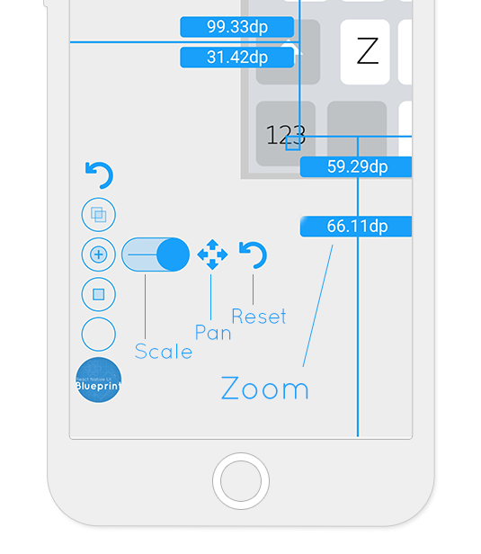
    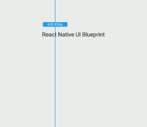
</div>


One of the most powerful tools in the Blueprint suite, zooming is applied to your application and all other functionality.

This allows you to work pixel by pixel on your screen, impressing everyone with the quality of your application.


## Feedback, Requests and Roadmap

Please use [GitHub issues] for feedback, questions or comments.

If you have specific feature requests or would like to vote on what others are recommending, please go to the [GitHub issues] section as well. I would love to see what you are thinking.

## Contributing

You can contribute in many ways to this project.

### Translating and documenting

I'm not a native speaker of the English language, so you may have noticed a lot of grammar errors in this documentation.

You can FORK this project and suggest improvements to this document (https://github.com/nidorx/react-native-ui-blueprint/edit/master/README.md).

If you find it more convenient, report a issue with the details on [GitHub issues].

### Reporting Issues

If you have encountered a problem with this component please file a defect on [GitHub issues].

Describe as much detail as possible to get the problem reproduced and eventually corrected.

### Fixing defects and adding improvements

1. Fork it (<https://github.com/nidorx/react-native-ui-blueprint/fork>)
2. Create your feature branch (`git checkout -b feature/fooBar`)
3. Commit your changes (`git commit -am 'Add some fooBar'`)
4. Push to the branch (`git push origin feature/fooBar`)
5. Create a new Pull Request

## License

This code is distributed under the terms and conditions of the [MIT license](LICENSE.md).


[dp]: https://en.wikipedia.org/wiki/Device-independent_pixel
[GitHub issues]: https://github.com/nidorx/react-native-ui-blueprint/issues
