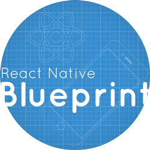

<div align="center">
    <h1>React Native Colibri</h1>
    
    <p align="center">
        Fast, Small and Beautiful
    </p>    
    <p>
        <a href="https://badge.fury.io/js/react-native-colibri">
            
        </a>
        <a href="https://travis-ci.org/nidorx/react-native-colibri">
            
        </a>
    </p>
</div>

<br>

Colibri is front-end framework created to build cross platform Android & iOS mobile apps using ready to use generic components of React Native. It contains a set of general purpose UI components styled in a similar way.

## Quick Start

You can install React Native Colibri via Yarn or NPM.

```bash
# Yarn
yarn add react-native-colibri

# NPM
npm i react-native-colibri --save
```

Link resources (Fonts on Android)

```bash
react-native link
```


## Guidelines


### Typography


####  Installing custom fonts

#### Configuring fonts in Theme

Example:

```jsx
import { setTheme} from 'react-native-colibri';

setTheme({
    fontFamily:{
        thin: 'Roboto-Thin',
        thinItalic: 'Roboto-ThinItalic',
        light: 'Roboto-Light',
        lightItalic: 'Roboto-LightItalic',
        regular: 'Roboto-Regular',
        regularItalic: 'Roboto-RegularItalic',
        medium: 'Roboto-Medium',
        mediumItalic: 'Roboto-MediumItalic',
        bold: 'Roboto-Bold',
        boldItalic: 'Roboto-BoldItalic',
    }
});
```


## Components

### Button
A button consists of text that clearly communicates what action will occur when the user touches it.

### Card
This page provides guidance on the base elements of a card

### Carousel
Allows you to display multiple items in a horizontal slide.

### CarouselImage
Allows you to display multiple items in a horizontal slide with images, like Google Play Store.

### DateFormatted

### DatePicker

### EmptyState

### Loading

### OkCancelView

### Segment

### Separator

### SimpleText

### Title

### AnimatedModal

### TableView

### Utils
